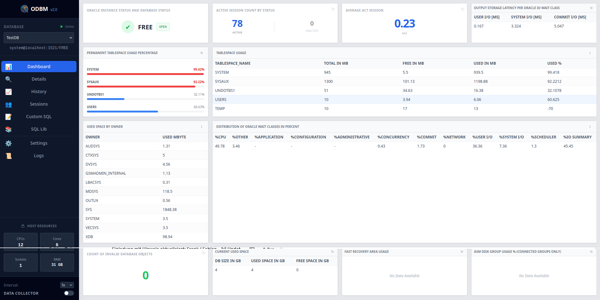

# ODBM — Oracle Database Monitor

[](https://github.com/Bruchsaal/odbm/actions/workflows/test.yml)
[](LICENSE)

A zero-install diagnostic console for a single Oracle instance. One binary, no
agent, no repository database — copy it to a host, run it, and get 70 curated
diagnostics plus ad-hoc SQL with execution plans in a browser.



## No Diagnostics or Tuning Pack required

Every query reads only `v$` and `dba_` views. ODBM never touches AWR or ASH
(`dba_hist_*`, `v$active_session_history`), which are gated behind the Oracle
Diagnostics Pack (~$7,500/processor) and Tuning Pack (~$5,000/processor, and it
requires Diagnostics as a prerequisite).

That is an architectural guarantee, not a setting — see [CONTRIBUTING.md](CONTRIBUTING.md),
where it is a hard project invariant enforced by the test suite.

## What this is not

**ODBM is not a monitoring system.** It has no fleet view, no paging, no
long-term retention, and no authentication. It is the tool you reach for when
you need to understand an unfamiliar or misbehaving database *right now* and
there is nothing already watching it.

If you need unattended monitoring across many databases with alerting, use
[oracledb_exporter](https://github.com/iamseth/oracledb_exporter) or Oracle's own
[Database Metrics Exporter](https://www.oracle.com/database/database-exporter/)
with Prometheus and Grafana, or `check_oracle_health` with Nagios/Icinga. ODBM
complements those; it does not replace them.

## Running

```bash
pip install -r requirements.txt
python main.py            # serves http://127.0.0.1:9000 and opens a browser
```

Or download a single-file binary for Linux, Windows or macOS from
[Releases](https://github.com/Bruchsaal/odbm/releases) — no Python needed.

> Run the binary from its own directory, not from a git checkout. `queries.json`
> and `settings.json` are both shipped defaults *and* runtime state, so running
> in place will modify tracked files.

Files created next to the executable on first run:

| File | Contents |
| --- | --- |
| `connections.json` | Saved connections. Passwords encrypted. Mode `0600`. |
| `.odbm_key` | Local encryption key. Mode `0600`. Never commit or share it. |
| `queries.json` | The SQL library. |
| `settings.json` | Which query backs which dashboard widget. |
| `collector.json` | Background collector state. |
| `history_<conn>.db` | Recorded metric history, one SQLite file per connection. |

## Security model

The API has **no authentication** and can run arbitrary SQL against the
configured database, so it binds to `127.0.0.1` only. Do not expose it.

```bash
ODBM_HOST=0.0.0.0 python main.py   # logs a warning; anyone who can reach
                                   # the port owns your database
```

Passwords are encrypted at rest with a key stored beside the config and are
never sent to the browser — the UI receives a `has_password` flag instead. See
[SECURITY.md](SECURITY.md).

## The query library

Every panel is backed by an editable query. Three optional properties, all
editable in the Library tab, control how each one behaves:

| Property | Effect |
| --- | --- |
| `refreshOptimum` | Reuse a cached result for N seconds. `0` disables caching. |
| `historyName` | Series name for trending. Empty means it is not recorded. |
| `alert` | Threshold rule; see below. Empty means no alerting. |

```json
"alert": {
  "metric": "Usage %",
  "label": "TABLESPACE_NAME",
  "warn": 85,
  "crit": 95,
  "direction": "above"
}
```

Rules are evaluated per row, so one tablespace at 96% is not hidden by another
at 10%. Transitions are logged once rather than every cycle.

Adding a query and tagging it with a `historyName` is all it takes to start
trending it — the background collector picks it up automatically.

## Background collection

History is recorded by a server-side collector, so it keeps running with no
browser open, across every connection marked *Collect history in the
background*. It resumes automatically after a restart.

## Multitenant (CDB/PDB)

`dba_*` views are container-scoped: connected to a CDB root they silently return
only the root's data. ODBM detects the container at connect time and says so in
the UI rather than quietly under-reporting. Connect to a PDB service directly
for per-PDB figures.

## Tests

```bash
pip install -r requirements-dev.txt
python -m pytest
```

The suite mocks the Oracle driver, so no database is needed. Tests covering the
JavaScript escaping helper are skipped when `node` is unavailable.

## Licence

[GNU AGPL-3.0-or-later](LICENSE). Free to use, study, modify and share. If you
modify ODBM and let others use it — including over a network — you must make
your modified source available to them under the same licence.

See [COPYRIGHT](COPYRIGHT) and [THIRD-PARTY-NOTICES.md](THIRD-PARTY-NOTICES.md).
